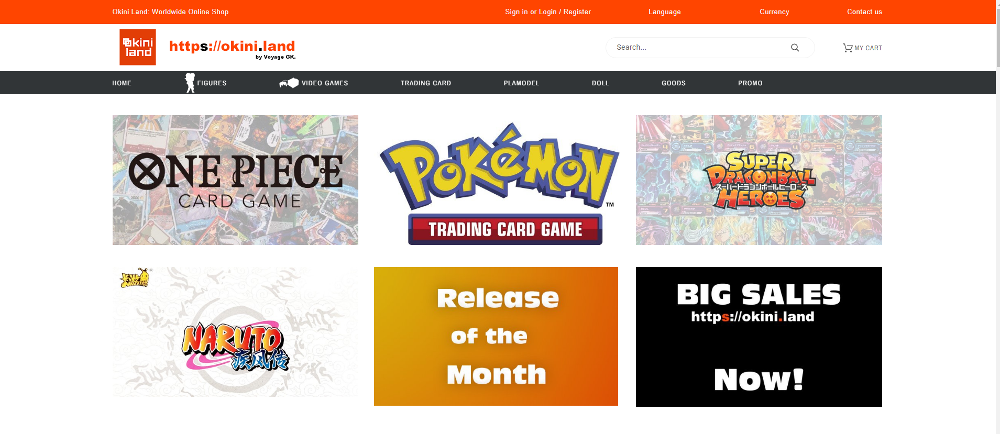
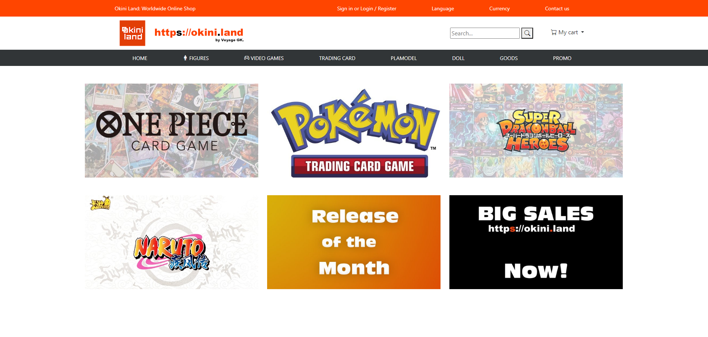

## Introduction
UI frameworks can be as hard to learn as a new programming language you have never learned before. Does this make UI frameworks worth learning or should we just stick to the basics and use raw CSS and HTML? Well, it really depends as UI frameworks can allow an individual to have reusability with a UI by using the given framework. Even though this is true frameworks have their limits and they can’t do everything raw CSS and HTML can do because they have prebuilt libraries and components. Therefore, the question is whether UI frameworks or raw CSS and HTML is better to use for UIs. In this essay I will explain in detail my experience using Bootstrap 5, raw CSS and HTML, and discuss my perspectives on UI frameworks.

## HTML and CSS
For the past couple weeks I have been working with CSS and HTML and I believe that CSS and HTML by itself can be used to make UIs, but they aren’t very efficient because it takes a lot of code to build certain elements such a spacing, navbars, etc. For example, you have a website with multiple elements that are navbars, and in the end you will have to replicate the code for that navbar multiple times, but some might have different parameters such as spacing, color, etc. So by using raw HTML and CSS your style.css file will be filled with many different functions and customizations in order to change the style of each navbar. Compared to a UI framework such as bootstrap it definitely provides more options., but it takes much longer to implement certain pieces of code that bootstrap can do with one class word.

## UI Framework Advantages
For the past week I have been working with Bootstrap and it is very interesting to use as it uses a bunch of preset classes to set customizations or elements such as row/col and navbars. Before you think learning a UI framework is useless because raw CSS and HTML can do the same thing. First we need to realize that bootstrap will be hard to learn, but it uses CSS and HTML, but simplifies the code so we just have to use a class name instead of typing out a function that is multiple lines of code. So even if it will take time to learn, it will help you save way more time when coding a UI. As for the software engineering benefits of UI frameworks, we can see that it can help engineers to create the basics of a UI quickly and then be able to customize it after we have built it up using the preset/given framework. Moreover,  most importantly you don’t have to reinvent the wheel as the code for certain elements are included within the framework which helps with reusability. 

## UI Framework Disadvantages
As for the disadvantages of UI frameworks, we know that by using a UI framework it increases the amount of code we have to load, such as loading code we won’t use. Another disadvantage that I noticed when using Bootstrap 5 is that the customization with the framework is very limited and makes it very hard to use for customization when CSS has a multitude of options. A final disadvantage of using frameworks is that it will restrict your knowledge of CSS because if you just use the framework and don’t know what is going on behind the scenes in CSS then it won’t be very helpful to use. This is because CSS is the main building block for customization within these frameworks. 

## Conclusion
Throughout this essay we have talked about my experience with raw CSS and HTML, Bootstrap, and how each has their own advantages and disadvantages. We can now understand whether a UI framework can be helpful or hurtful to our project, and whether or not we should just stick with basics. Moreover , I believe that using a framework to get started and then using CSS to customize your page further is a good way to make a custom UI. This combines the reusability of a UI framework and the customizability of CSS to help create a custom UI with a faster development process. 

