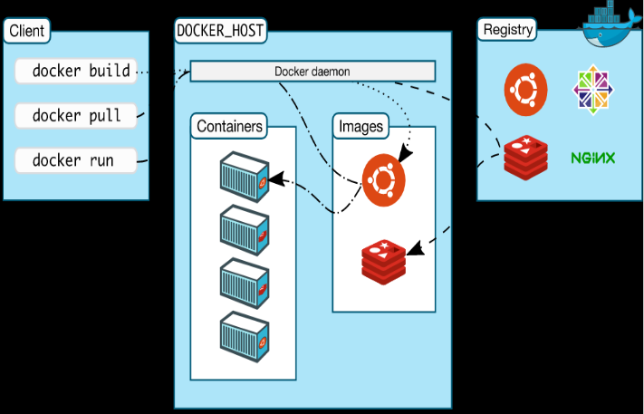

## Project Objective
This project aimed to deploy a containerized environment for application development for DISA BDP. The project would use a big data platform which is a combination of several big data applications and utilities within a single solution. Through a containerization software called docker, I was able to package applications into containers with all their dependencies. Through these containers, I am able to create, deploy, and run applications. Containerization is a quick way to develop and ship applications, especially with varying systems/machines. Such applications that are important for big data include Hadoop, Elastic Search, Kibana, and Storm. Furthermore, The task was to create an environment that would be able to run multiple applications and have them communicate with each other through docker containers. 

## My Responsibility 
In this project, I was the sole student working with the docker code and worked with my mentor to make sure I was working in the right direction, so I was responsible for all the work in this project. The project was about creating a containerized environment that could house applications such as Elastic, Search, Kibana, and Storm, and make them function together cohesively. My task involved making configuration files for images (a file used to execute code in a Docker container) so that when the container ran on a certain image I would get the exact settings I wanted for that certain application. I also worked with yaml files because this allowed me to connect the containers to each other and make them communicate in the way I wanted them to. Within this yaml file, I was able to configure things such as ports of the container, whether or not a container depends on another to run, and volumes (a persistent storage location that exists outside of the container).

## What I learned 
I learned a lot through this project such as understanding Docker, Containerization, Elastic search, and Kibana, the importance of containerization, and learning to work on a topic having no prior experience. For example, I learned how to create a docker container through an image I set the configuration settings for and ran these containers in parallel with the docker-compose command. I also learned how to connect these containers so that they could communicate with each other and input and output data according to their needs. For example, you need to run Elastic Search before we run Kibana, because we need Elastic search to search engine and once running we can then run Kibana which visualizes the information ingested into it. Below is a snippet of the Elastic Search/Kibana docker-compose yaml file. 

