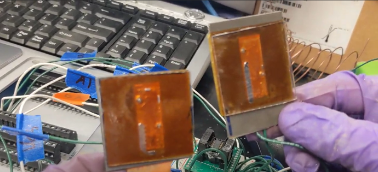
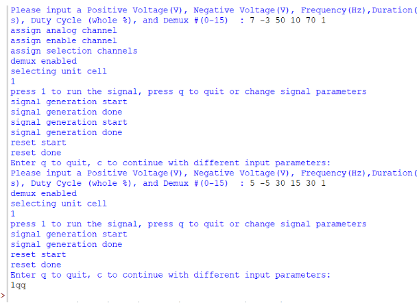

## Project Objective
This project aimed to create a circuit and software within Python to control liquid metal actuation for an array of unit cells with a DAQ. This project was part of a larger project that was aimed at creating an IRS(Intelligent Reflecting Surface). For this particular project, the goal was to use the DAQ to create a circuit that could output a square wave to each unit cell, which would actuate the liquid metal from one side of the channel to the other side of the channel and be able to go back the other way as well. Another goal we had was to create a program using Python that would allow a user to test the actuation of the liquid metal using the DAQ and the supporting circuitry. The main objective of creating this program was to allow the user to enter specified parameters and with those parameters, the DAQ would output a certain AC voltage, frequency, and duty cycle for a certain duration and for a specific demultiplexer within the circuit. 

## My Responsibility 
In this project, I was working with a partner to complete this task and we did so in order to fix each other's mistakes and provide any new ideas that could possibly help us to reach our goals. As for what I was specifically responsible for, I was responsible for working with injecting the unit cells with liquid metal, setting up the circuit correctly, and helping to create the user prompt to control liquid metal actuation. I had to inject liquid metal into microchannels with micrometer dimensions and check the circuitry to ensure the setup was 100% correct and adjusted to what we were testing or else we could have an open circuit or short circuit which can be dangerous especially when working with high voltages/current. I was also able to help create a program that would collect user input and then use the user input to output a certain AC voltage, frequency, duty cycle, and duration to a certain demultiplexer. This code would ruin through the DAQ in which the DAQ would output a signal with the specific parameters the user defined allowing the user to test the circuit with their own values. 

## What I learned 
I learned a lot through this project such as how liquid metal is able to actuate with the use of an AC voltage and is called CEW (Continuous Electro-wetting), how to use a DAQ, how to inject liquid metal into a microchannel, how to make a microchannel, and useful python coding skills I can use to make a program. Furthermore, the most important thing I learned from this project is the idea that what you are working on can always improve because even though it may seem that what you have done is perfect there is always something that can be adjusted to make it better. Liquid metal is a topic I never thought I would dive into, but it is a very intriguing field of study as we can use liquid metal elements rather than static elements to create inventions that could make a huge impact on the world. For example, a device with just static elements can only do so much and we can relate this to static and dynamic variables because like with dynamic variables, dynamic elements should be able to provide more options since it isn't stagnant. 

